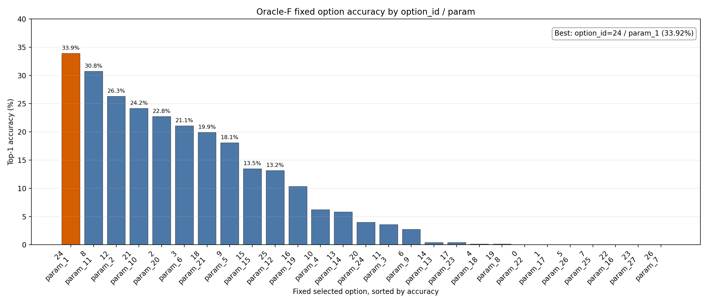
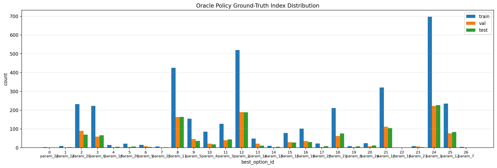
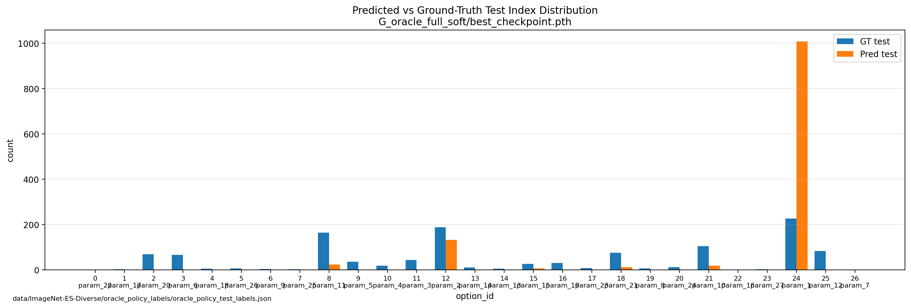
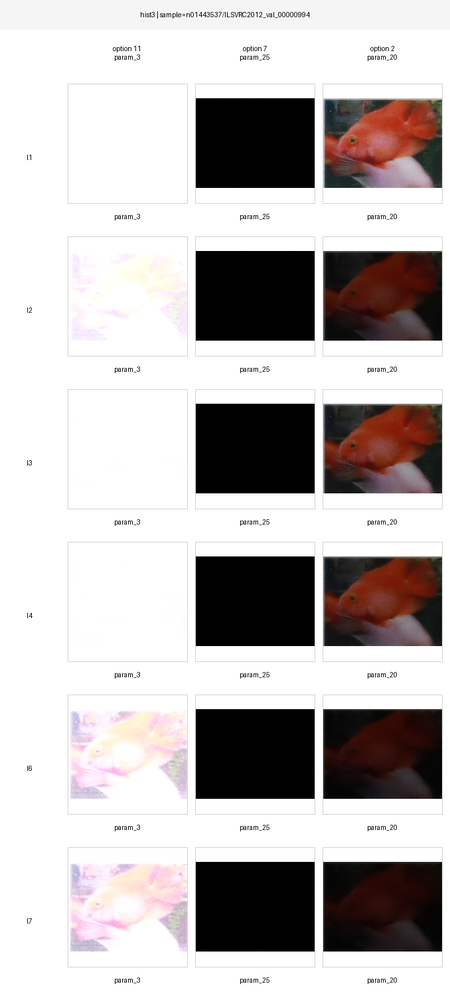
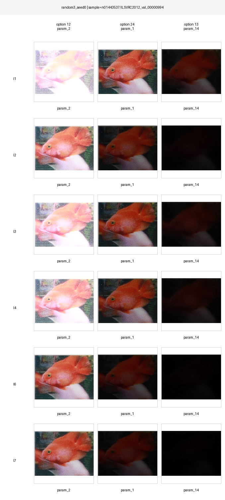
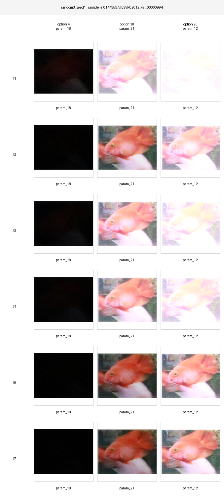
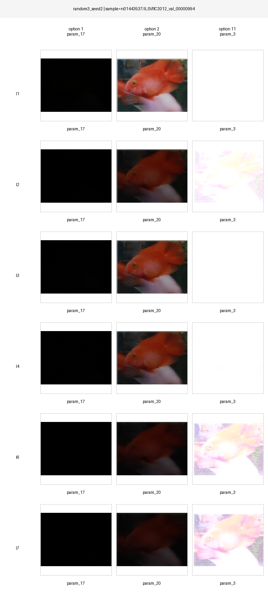

# Report in responce of Debugging Experiments
## Verify Possible Results Mix-up
[Results for the suspicious random noise](../policy_network/results_random_noise/G_oracle_full_soft)

[Results for all the baselines](../policy_network/results/acquisition_baselines_test.json)
1. checked the random noise input index predictions

[policy_network/static_pred/debug/summarize_downstream_selected_indices.py](../policy_network/static_pred/debug/summarize_downstream_selected_indices.py)

    ```
    total=1200
    downstream_acc=33.92%
    selected_equals_target=17.75% 

    option_id=24 param_1   count=978
   
    option_id=8  param_11  count=66

    option_id=12 param_2   count=139

    option_id=18 param_21  count=7

    option_id=21 param_10  count=6

    option_id=9  param_5   count=2

    option_id=15 param_15  count=2
    ```

2. Diagonse the index pred of noise input
    How about we manually set all the other option id to index 24, will at get the same downstream accuracy?  
    [policy_network/static_pred/debug/counterfactual_force_option.py](../policy_network/static_pred/debug/counterfactual_force_option.py)

    Result: we got accuracy at 408/1200 (34.0%), while the baseline got 407/1200 (33.92%). 
    Reason: baseline run on cpu while random noise experiment run on cuda. 
    Fix: rerun the baselines on cuda

    Fixed result on cuda: [policy_network/results/acquisition_baselines_test_cuda.json](../policy_network/results/acquisition_baselines_test_cuda.json) and it aligns with previous results.

    | Method | Correct / Total | Accuracy | Note |
    | --- | ---: | ---: | --- |
    | AE | 140 / 1200 | 11.67% | auto exposure baseline |
    | Random | - / 1200 | 9.55% | mean random accuracy |
    | LENS | 387 / 1200 | 32.25% | learned policy baseline |
    | Oracle-Specific | 612 / 1200 | 51.00% | per-sample best option |
    | Oracle-Fixed | 408 / 1200 | 34.00% | best fixed option: option_id=24 / param_1 |

3. A side note: the option_id to param mapping  
[policy_network/results_random_noise/G_oracle_full_soft/downstream_selected_index_stats.json](../policy_network/results_random_noise/G_oracle_full_soft/downstream_selected_index_stats.json)

    The `option_name_map` field defines the mapping from each `option_id` to its corresponding sensor parameter setting.

## Fixed Index Baseline Sweep
Evaluate downstream accuracy for every fixed index (an extended experiment for Oracle-Fixed)

[policy_network/static_pred/debug/eval_acquisition_baselines.py](../policy_network/static_pred/debug/eval_acquisition_baselines.py)

Results at [policy_network/results/acquisition_baselines_test_cuda.json](../policy_network/results/acquisition_baselines_test_cuda.json)

Visualize the result:




## Dual input with all possible fixed index k
```
input = [auto-exposure param_1 image, fixed option_id=k image]
backbone = mobilenet_v3_small
setting = F
label = oracle hard label
loss = hard_ce
trainable_scope = full_finetune
input_mode = dual
input_variant = real
```

The table below uses the best checkpoint for each fixed-k run:

| Fixed k | Param | Test Index Acc | Downstream Top-1 Acc | Downstream Top-5 Cumulative Acc |
| ---: | --- | ---: | ---: | ---: |
| 0 | `param_22` | `21.58% (259 / 1200)` | `35.50% (426 / 1200)` | `47.50% (570 / 1200)` |
| 1 | `param_17` | `21.92% (263 / 1200)` | `35.00% (420 / 1200)` | `47.33% (568 / 1200)` |
| 2 | `param_20` | `21.58% (259 / 1200)` | `35.42% (425 / 1200)` | `47.92% (575 / 1200)` |
| 3 | `param_6` | `21.92% (263 / 1200)` | `34.83% (418 / 1200)` | `47.42% (569 / 1200)` |
| 4 | `param_18` | `21.08% (253 / 1200)` | `35.42% (425 / 1200)` | `47.67% (572 / 1200)` |
| 5 | `param_26` | `20.42% (245 / 1200)` | `34.92% (419 / 1200)` | `47.17% (566 / 1200)` |
| 6 | `param_9` | `20.25% (243 / 1200)` | `33.92% (407 / 1200)` | `47.58% (571 / 1200)` |
| 7 | `param_25` | `19.75% (237 / 1200)` | `33.92% (407 / 1200)` | `46.33% (556 / 1200)` |
| 8 | `param_11` | `20.83% (250 / 1200)` | `34.75% (417 / 1200)` | `47.75% (573 / 1200)` |
| 9 | `param_5` | `20.83% (250 / 1200)` | `34.58% (415 / 1200)` | `47.42% (569 / 1200)` |
| 10 | `param_4` | `21.83% (262 / 1200)` | `36.25% (435 / 1200)` | `47.58% (571 / 1200)` |
| 11 | `param_3` | `20.83% (250 / 1200)` | `34.75% (417 / 1200)` | `47.33% (568 / 1200)` |
| 12 | `param_2` | `20.50% (246 / 1200)` | `34.42% (413 / 1200)` | `47.00% (564 / 1200)` |
| 13 | `param_14` | `21.08% (253 / 1200)` | `34.75% (417 / 1200)` | `47.42% (569 / 1200)` |
| 14 | `param_13` | `22.00% (264 / 1200)` | `35.75% (429 / 1200)` | `47.83% (574 / 1200)` |
| 15 | `param_15` | `22.08% (265 / 1200)` | `35.50% (426 / 1200)` | `47.92% (575 / 1200)` |
| 16 | `param_19` | `20.67% (248 / 1200)` | `34.92% (419 / 1200)` | `47.75% (573 / 1200)` |
| 17 | `param_23` | `21.25% (255 / 1200)` | `35.25% (423 / 1200)` | `47.33% (568 / 1200)` |
| 18 | `param_21` | `22.25% (267 / 1200)` | `35.42% (425 / 1200)` | `46.67% (560 / 1200)` |
| 19 | `param_8` | `22.67% (272 / 1200)` | `36.25% (435 / 1200)` | `47.17% (566 / 1200)` |
| 20 | `param_24` | `20.50% (246 / 1200)` | `34.50% (414 / 1200)` | `47.67% (572 / 1200)` |
| 21 | `param_10` | `20.92% (251 / 1200)` | `34.00% (408 / 1200)` | `47.75% (573 / 1200)` |
| 22 | `param_16` | `20.50% (246 / 1200)` | `35.67% (428 / 1200)` | `46.75% (561 / 1200)` |
| 23 | `param_27` | `21.42% (257 / 1200)` | `35.42% (425 / 1200)` | `47.25% (567 / 1200)` |
| 24 | `param_1` | `22.00% (264 / 1200)` | `35.08% (421 / 1200)` | `47.67% (572 / 1200)` |
| 25 | `param_12` | `22.00% (264 / 1200)` | `35.50% (426 / 1200)` | `47.33% (568 / 1200)` |
| 26 | `param_7` | `19.50% (234 / 1200)` | `34.25% (411 / 1200)` | `47.08% (565 / 1200)` |

Best results:
- Best test index accuracy: fixed k = 19 (`param_8`), `22.67%`.
- Best downstream Top-1 accuracy: fixed k = 10 (`param_4`) and fixed k = 19 (`param_8`), both `36.25%`.
- Best downstream Top-5 cumulative accuracy: fixed k = 2 (`param_20`) and fixed k = 15 (`param_15`), both `47.92%`.


## Visualize the index distribution
- Ground truth index distribution:
    - Script: [policy_network/static_pred/debugvisualize_oracle_policy_index_distribution.py](../policy_network/static_pred/debug/visualize_oracle_policy_index_distribution.py)

nVisualization png: 
    

- Random Noise G:
    - [Script](../policy_network/static_pred/debug/visualize_pred_vs_gt_index_distribution.py) to compare any checkpoint's test index distribution with ground truth




## Give Policy network several extreme images
Problem: the dataset/paper does not provide a reliable mapping from `param_k` to physical camera parameters such as `(ISO, shutter speed, aperture)`. Therefore, instead of choosing physical corners, we choose several image-space probes automatically.

### Method: brightness-histogram diverse probes

For each candidate `option_id`, compute the average brightness histogram over all available samples (`train + val + test`). This is unsupervised: it does not use `best_option_id`, downstream correctness, or oracle labels.

Brightness is computed as:

```
Y = 0.299 R + 0.587 G + 0.114 B
```

Then:
1. Build a normalized 64-bin brightness histogram for each option.
2. Compute pairwise Jensen-Shannon distance between option histograms.
3. Select 3 options with farthest-point sampling.
4. Compare against three random 3-option probe sets.

The selected probes are:

| Probe Set | Option IDs | Params |
| --- | --- | --- |
| Hist3 | `[11, 7, 2]` | `param_3`, `param_25`, `param_20` |
| Random3 seed 0 | `[12, 24, 13]` | `param_2`, `param_1`, `param_14` |
| Random3 seed 1 | `[4, 18, 25]` | `param_18`, `param_21`, `param_12` |
| Random3 seed 2 | `[1, 2, 11]` | `param_17`, `param_20`, `param_3` |

### Policy training setup

```
backbone = mobilenet_v3_small
label = oracle hard label
loss = hard_ce
trainable_scope = full_finetune
input_mode = multiview
input_variant = real
```

Experiments:

| ID | Policy Input |
| --- | --- |
| H1 | `[hist3 option images]` |
| H2 | `[auto-exposure image, hist3 option images]` |
| R1-seed0/1/2 | `[random3 option images]` |

Key scripts:
- Probe selection: [policy_network/static_pred/debug/select_brightness_histogram_probes.py](../policy_network/static_pred/debug/select_brightness_histogram_probes.py)
- Training script: [policy_network/static_pred/run_hist3_multiview_experiments.sh](../policy_network/static_pred/run_hist3_multiview_experiments.sh)
- Downstream eval: [policy_network/static_pred/eval_hist3_multiview_downstream.sh](../policy_network/static_pred/eval_hist3_multiview_downstream.sh)
- Visualization script: [policy_network/static_pred/visualize_hist3_multiview_results.sh](../policy_network/static_pred/visualize_hist3_multiview_results.sh)

### Results

The table below uses the best checkpoint for each run:

| Experiment | Test Index Acc | Pred Nonzero Indices | Downstream Top-1 Acc | Downstream Top-5 Cumulative Acc |
| --- | ---: | ---: | ---: | ---: |
| H1 Hist3 only | `19.83% (238 / 1200)` | `7` | `35.00% (420 / 1200)` | `47.50% (570 / 1200)` |
| H2 AE + Hist3 | `21.25% (255 / 1200)` | `6` | `34.42% (413 / 1200)` | `47.67% (572 / 1200)` |
| R1 Random3 seed 0 | `19.00% (228 / 1200)` | `8` | `33.33% (400 / 1200)` | `47.50% (570 / 1200)` |
| R1 Random3 seed 1 | `22.33% (268 / 1200)` | `13` | `36.08% (433 / 1200)` | `47.33% (568 / 1200)` |
| R1 Random3 seed 2 | `20.25% (243 / 1200)` | `13` | `35.42% (425 / 1200)` | `47.42% (569 / 1200)` |

### Visualizations
Selected probe images under each lighting condition:





Predicted vs ground-truth test index distribution:


