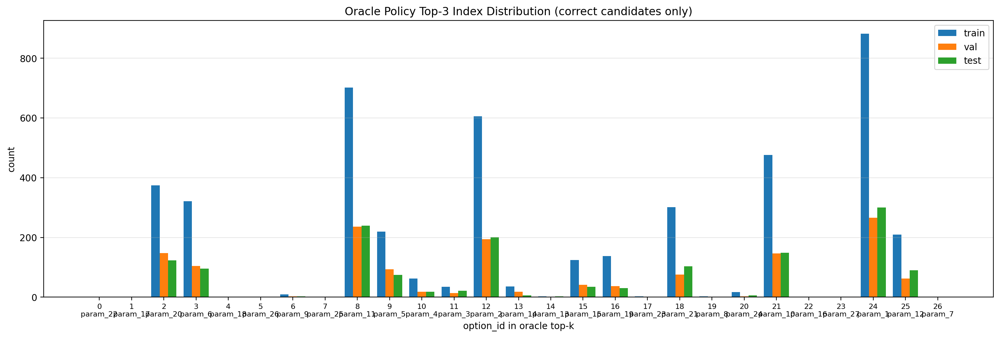
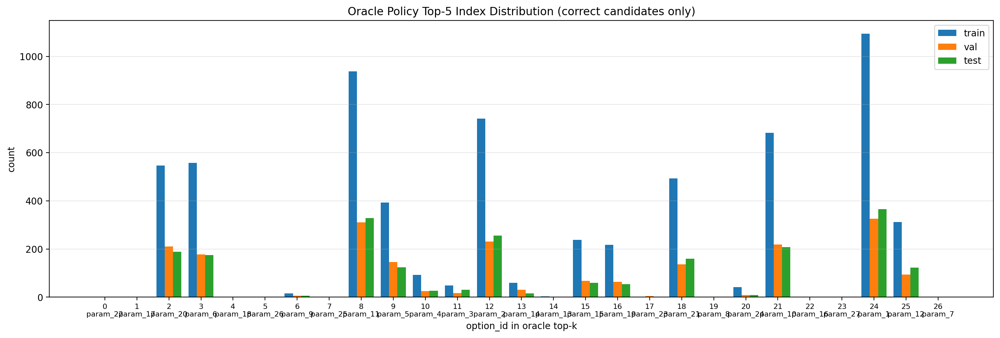

# Random-input ablation and oracle top-k distribution

We set up inference-stage random-input ablation for the 27 fixed-k policy networks. 

Downstream Top-1 results are summarized in Excel, with one sheet per input setting: [downstream_top1_by_input_setting.xlsx](../policy_network/results_random_input_ablation_inference/downstream_top1_by_input_setting.xlsx).

# Index Distribution Topk
Oracle top-k index distribution is plotted using **true downstream-correct candidates only** (`oracle_num_correct_candidates > 0`); no-correct fallback labels are excluded from these corrected plots.

Top-k correct-candidate entries:

| Split | Positive samples | Top-3 entries | Top-5 entries |
| --- | ---: | ---: | ---: |
| train | `1796 / 3600` | `4517` | `6476` |
| val | `588 / 1200` | `1456` | `2071` |
| test | `612 / 1200` | `1494` | `2132` |
